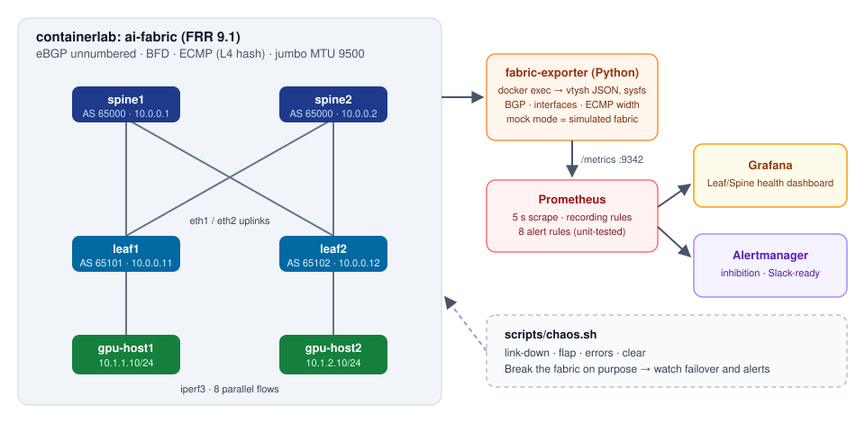
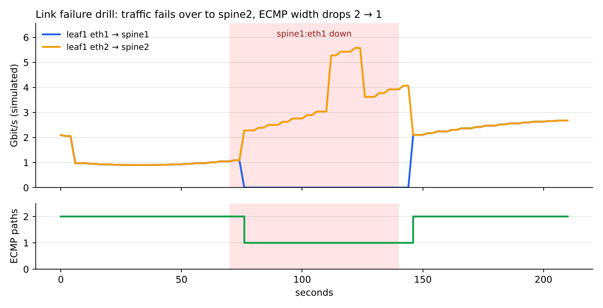

# AI Fabric Monitor

**A leaf-spine data center fabric with live telemetry, alerting and failure drills, built to show how I monitor the network under a GPU cluster.**



GPU training jobs are only as fast as the network between the servers. One failed uplink or dirty optic can quietly cut all-reduce bandwidth in half, and nobody notices until a job slows down. This project builds a small Clos fabric with the same parts as a production AI fabric: eBGP unnumbered, ECMP, BFD and jumbo frames. It then watches the signals that matter to a data center network engineer:

| Signal | Why it matters on a GPU fabric |
|---|---|
| BGP session state and flaps | A dropped leaf-spine session removes a path for every GPU behind that leaf |
| **ECMP width** per GPU subnet | 2 → 1 paths means half the east-west bandwidth, even though everything still "pings" |
| Uplink **load imbalance** | Few large RDMA flows can hash onto one spine (flow polarisation) |
| Interface errors | CRC errors are almost always physical: a dirty connector, bad DAC/AOC or failing transceiver |
| Link utilisation | Sustained >80% means congestion and PFC pause storms on lossless fabrics |

## Stack

- **Fabric:** [containerlab](https://containerlab.dev) with FRRouting 9.1: 2 spines, 2 leaves and 2 "GPU hosts"
- **Exporter:** a Python Prometheus exporter I wrote. It reads FRR's JSON output (`show bgp summary json`, `show ip route json`) and interface counters from sysfs.
- **Prometheus:** recording rules (bps, utilisation, ECMP imbalance) and 8 alert rules covered by `promtool` unit tests
- **Alertmanager:** inhibition rules, so one physical failure doesn't page three times; Slack receiver ready to enable
- **Grafana:** a provisioned "Leaf/Spine Health" dashboard
- **CI:** GitHub Actions runs ruff, pytest, `promtool check/test rules`, `amtool check-config` and JSON/YAML validation

## Quick start

### Option A: demo mode (any laptop with Docker, about 2 minutes)

The exporter simulates the 2×2 fabric with realistic traffic, ECMP and failures. It outputs FRR-shaped JSON, so the same parsers run as in the real lab.

```bash
make demo
# Grafana      http://localhost:3000   (anonymous viewer, admin/admin to edit)
# Prometheus   http://localhost:9090
# Alertmanager http://localhost:9093
```

### Option B: the real FRR fabric (Linux host with Docker and containerlab)

```bash
make lab-up          # deploys the fabric, starts monitoring in docker mode, runs verify-lab.sh
make traffic         # iperf3: gpu-host1 -> gpu-host2, 8 parallel flows for 120 s
```

`verify-lab.sh` checks that every BGP session is Established, that each leaf has **2 ECMP paths** to the other GPU subnet, and that the hosts can reach each other end to end.

## Failure drills

```bash
scripts/chaos.sh link-down spine1:eth1   # fail a leaf-spine link
scripts/chaos.sh errors    leaf2:eth2    # "dirty optic": CRC errors (mock) / 5% loss (lab)
scripts/chaos.sh flap      spine2:eth2 5 # flap a link 5 times
scripts/chaos.sh clear                   # restore everything
```

The script detects whether the containerlab fabric is running. If it is, it uses `ip link` and `tc netem` inside the FRR nodes; otherwise it drives the simulator.



*Recorded in demo mode: Prometheus data from a real drill against the simulated fabric (`chaos.sh link-down spine1:eth1`, then `clear`).*

What you should see after `link-down spine1:eth1`:

| Time | Event |
|---|---|
| ~1 s | `fabric_interface_oper_up` drops on leaf1/eth1 and spine1/eth1 |
| ~1–9 s | BGP session goes down (BFD in the lab, 3 s/9 s timers as fallback) |
| 15 s | `FabricLinkDown` and `BGPSessionDown` fire. Alertmanager **suppresses** the BGP alert because the link alert explains it |
| 30 s | `ECMPDegraded` fires: leaf1 → 10.1.2.0/24 drops from 2 paths to 1 and all traffic moves to spine2. Alertmanager only notifies for **leaf2**, which lost a path without a local link failure |

## Metrics

| Metric | Labels | Description |
|---|---|---|
| `fabric_device_up` | device, role | Exporter could poll the device |
| `fabric_bgp_peer_up` | device, peer, remote_device, remote_as | 1 = Established |
| `fabric_bgp_peer_uptime_seconds` | ″ | Session uptime |
| `fabric_bgp_prefixes_received` / `_sent` | ″ | Prefix counts |
| `fabric_interface_oper_up` | device, interface | Operational state |
| `fabric_interface_{rx,tx}_{bytes,packets,errors,dropped}_total` | ″ | Counters |
| `fabric_interface_mtu_bytes`, `fabric_interface_speed_bps` | ″ | Config |
| `fabric_route_ecmp_paths` | device, prefix | Active next hops per BGP route |
| `fabric_bgp_routes` | device | Installed BGP routes |

Recording rules: `fabric:interface_{tx,rx}_bps`, `fabric:interface_{tx,rx}_utilization:ratio`, `fabric:interface_errors:rate1m`, `fabric:leaf_uplink_imbalance:ratio`, `fabric:gpu_traffic_bps`.

## Alerts

| Alert | Condition | Severity |
|---|---|---|
| FabricDeviceUnreachable | device not pollable for 30 s | critical |
| BGPSessionDown | session not Established for 15 s | critical |
| BGPSessionFlapping | more than 4 state changes in 10 min | warning |
| FabricLinkDown | leaf-spine link down for 15 s | critical |
| ECMPDegraded | fewer than 2 paths to a GPU subnet for 30 s | warning |
| InterfaceErrors | any error rate for 1 min | warning |
| LinkUtilizationHigh | TX above 80% for 2 min | warning |
| ECMPLoadImbalance | uplinks differ by more than 30% under load for 5 min | info |

## Design notes

- **eBGP unnumbered (RFC 5549):** No IP plan for point-to-point links. Each leaf peers over its interface's IPv6 link-local address. This is the same pattern used in large Clos fabrics.
- **Same ASN on all spines:** Leaves can't use one spine as transit to reach another, which is the standard way to avoid path hunting.
- **`fib_multipath_hash_policy=1`:** Linux's default ECMP hash is L3 only, so all flows between two GPU hosts would take one spine. L4 hashing spreads iperf3's parallel streams. The same question comes up with RoCE and NCCL traffic on real fabrics.
- **Read-only telemetry:** The exporter only runs `show` commands and reads sysfs. One unreachable device never breaks the whole scrape (`fabric_device_up=0` instead).
- **Test-first rules:** Every alert I rely on has a `promtool` unit test, so a refactor can't silently break paging.

## Project layout

```
topology/        containerlab topology and FRR configs (spines, leaves)
exporter/        Python exporter, fixtures captured in FRR JSON format, pytest suite
monitoring/      docker-compose, Prometheus rules and tests, Alertmanager, Grafana provisioning
scripts/         chaos.sh, traffic.sh, verify-lab.sh
docs/            architecture diagram
```

## Roadmap

- [ ] Arista cEOS nodes with **gNMI streaming telemetry** (via gnmic) alongside FRR
- [ ] Redfish/IPMI poller for GPU server BMC health (PSU, fans, inlet temperature)
- [ ] LLDP-based cabling validation against an intended cable map
- [ ] RoCE-style lossless queue metrics (PFC pause, ECN marks) when running on hardware

## License

MIT
